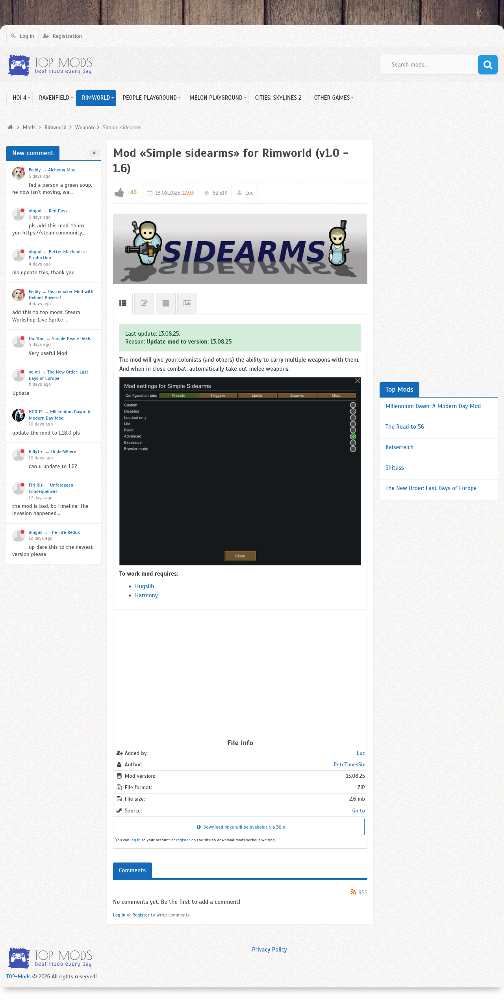

# Visited: https://top-mods.com/mods/rimworld/weapon/2547-simple-sidearms.html
**Time:** Sat May  9 00:08:28 UTC 2026

## Screenshot

## Raw HTML
[page.html](./page.html)

## Downloaded Media (0 files)
_No media files downloaded_

## Other Links
- [#tab-icms](#tab-icms)
- [#vote-up](#vote-up)
- [/](/)
- [/#](/#)
- [/auth/login](/auth/login)
- [/auth/register](/auth/register)
- [/cache/static/css/styles.4f29f26a599b6929ff40c12c04b19d0e.css?49](/cache/static/css/styles.4f29f26a599b6929ff40c12c04b19d0e.css?49)
- [/cache/static/js/scripts.34f37ebc5a9215a6cfd40fa6b691bd2d.js?49](/cache/static/js/scripts.34f37ebc5a9215a6cfd40fa6b691bd2d.js?49)
- [/mods](/mods)
- [/mods/action-sandbox](/mods/action-sandbox)
- [/mods/action-sandbox/building](/mods/action-sandbox/building)
- [/mods/action-sandbox/item](/mods/action-sandbox/item)
- [/mods/action-sandbox/npc](/mods/action-sandbox/npc)
- [/mods/action-sandbox/others](/mods/action-sandbox/others)
- [/mods/action-sandbox/vehicle](/mods/action-sandbox/vehicle)
- [/mods/action-sandbox/weapons](/mods/action-sandbox/weapons)
- [/mods/barotrauma](/mods/barotrauma)
- [/mods/bus-simulator-indonesia](/mods/bus-simulator-indonesia)
- [/mods/cities-skylines-2](/mods/cities-skylines-2)
- [/mods/ets-2](/mods/ets-2)
- [/mods/ets-2/buses](/mods/ets-2/buses)
- [/mods/ets-2/cars](/mods/ets-2/cars)
- [/mods/ets-2/interiors](/mods/ets-2/interiors)
- [/mods/ets-2/maps](/mods/ets-2/maps)
- [/mods/ets-2/others](/mods/ets-2/others)
- [/mods/ets-2/parts-tuning](/mods/ets-2/parts-tuning)
- [/mods/ets-2/skins](/mods/ets-2/skins)
- [/mods/ets-2/sounds](/mods/ets-2/sounds)
- [/mods/ets-2/traffic](/mods/ets-2/traffic)
- [/mods/ets-2/trailers](/mods/ets-2/trailers)
- [/mods/ets-2/trucks](/mods/ets-2/trucks)
- [/mods/ets-2/weather-mods](/mods/ets-2/weather-mods)
- [/mods/hoi-4](/mods/hoi-4)
- [/mods/hoi-4/alternative-history](/mods/hoi-4/alternative-history)
- [/mods/hoi-4/alternative-history/1115-the-new-order-last-days-of-europe.html](/mods/hoi-4/alternative-history/1115-the-new-order-last-days-of-europe.html)
- [/mods/hoi-4/alternative-history/1115-the-new-order-last-days-of-europe.html#comment_20088](/mods/hoi-4/alternative-history/1115-the-new-order-last-days-of-europe.html#comment_20088)
- [/mods/hoi-4/alternative-history/13000-red-dusk.html#comment_20093](/mods/hoi-4/alternative-history/13000-red-dusk.html#comment_20093)
- [/mods/hoi-4/alternative-history/14937-unforeseen-consequences.html#comment_20085](/mods/hoi-4/alternative-history/14937-unforeseen-consequences.html#comment_20085)
- [/mods/hoi-4/alternative-history/442-millennium-dawn-a-modern-day-mod.html](/mods/hoi-4/alternative-history/442-millennium-dawn-a-modern-day-mod.html)
- [/mods/hoi-4/alternative-history/442-millennium-dawn-a-modern-day-mod.html#comment_20087](/mods/hoi-4/alternative-history/442-millennium-dawn-a-modern-day-mod.html#comment_20087)
- [/mods/hoi-4/alternative-history/5-kaiserreich.html](/mods/hoi-4/alternative-history/5-kaiserreich.html)
- [/mods/hoi-4/balance](/mods/hoi-4/balance)
- [/mods/hoi-4/events](/mods/hoi-4/events)
- [/mods/hoi-4/gameplay](/mods/hoi-4/gameplay)
- [/mods/hoi-4/gameplay/10571-better-mechanics-production.html#comment_20092](/mods/hoi-4/gameplay/10571-better-mechanics-production.html#comment_20092)
- [/mods/hoi-4/gameplay/14780-the-fire-redux.html#comment_20084](/mods/hoi-4/gameplay/14780-the-fire-redux.html#comment_20084)
- [/mods/hoi-4/gameplay/15395-simple-peace-deals.html#comment_20089](/mods/hoi-4/gameplay/15395-simple-peace-deals.html#comment_20089)
- [/mods/hoi-4/gameplay/7-the-road-to-56.html](/mods/hoi-4/gameplay/7-the-road-to-56.html)
- [/mods/hoi-4/graphics](/mods/hoi-4/graphics)
- [/mods/hoi-4/map](/mods/hoi-4/map)

## Stats
- Links: 176
- Media: 0
